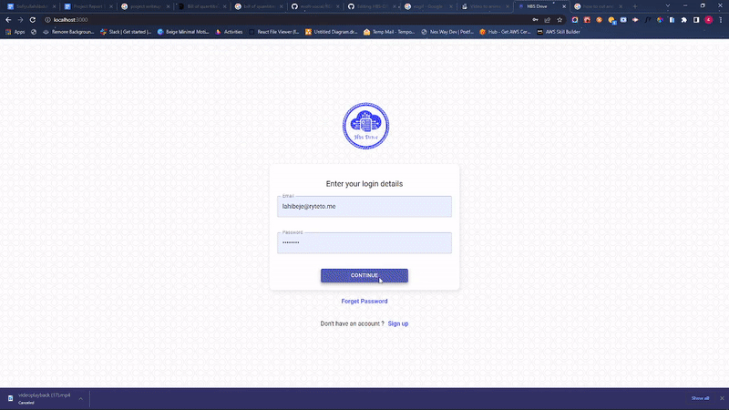
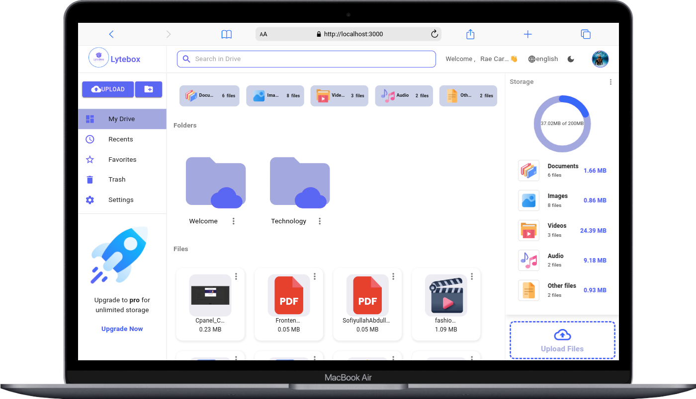

<div align="center">

# Lytebox

## Development of a Secured Cloud-Based Drive Application Using Web technologies

## Built by Sofiyullah Abdulllah

##### ALX Frontend Specialization Capstone Project

This project was bootstrapped with [Create React App](https://github.com/facebook/create-react-app).


# Lytebox | Keep it light and secure

### hbs-drive(rebranded)

 <h3>A Cloud Based Drive Web Application.</h3>

[](https://app.netlify.com/sites/evolt-myspace/deploys)



</div>

## Table of Contents

- [Lytebox](#lytebox)
  - [Development of a Secured Cloud-Based Drive Application Using Web technologies](#development-of-a-secured-cloud-based-drive-application-using-web-technologies)
  - [Built by Sofiyullah Abdulllah](#built-by-sofiyullah-abdulllah)
        - [ALX Frontend Specialization Capstone Project](#alx-frontend-specialization-capstone-project)
- [Lytebox | Keep it light and secure](#lytebox--keep-it-light-and-secure)
    - [hbs-drive(rebranded)](#hbs-driverebranded)
  - [Table of Contents](#table-of-contents)
  - [Getting Started](#getting-started)
  - [Live link](#live-link)
  - [About](#about)
  - [🛠 Technologies used](#-technologies-used)
  - [Features](#features)
  - [Project Structure](#project-structure)
  - [State Management](#state-management)
  - [Styling Mechanisms](#styling-mechanisms)
  - [Dependencies used](#dependencies-used)
  - [Screenshots](#screenshots)
  - [👨‍💻 Connect with me](#-connect-with-me)
  - [Learn More](#learn-more)

## Getting Started

- Clone the repository on your local machine with the command below in your terminal, and cd into the **lytebox** folder

```sh
git clone https://github.com/Precioussoul/lytebox.git
cd lytebox
```

- Install dependencies (if you are using **yarn** then do with that)

```sh
yarn install
```

- Create a `.env` file at the root level of the directory (at the level of `package.json`) and create a environment variables and use process.env to initialize them.

```
REACT_APP_FIREBASE_API_KEY= <YOUR API KEY>
REACT_APP_FIREBASE_AUTH_DOMAIN= <YOUR CLOUD AUTH DOMAIN>
REACT_APP_FIREBASE_PROJECT_ID=<YOUR PROJECT ID>
REACT_APP_FIREBASE_STORAGE_BUCKET=<YOUR CLOUD STORAGE BUCKET ID>
REACT_APP_FIREBASE_MESSAGE_SENDER_ID= <YOUR SENDER ID>
REACT_APP_FIREBASE_APP_ID=<YOUR GENERATED APP ID>
```

- Start the development server🚀

```
yarn start

Runs the app in the development mode.\
Open [http://localhost:3000](http://localhost:3000) to view it in your browser.

The page will reload when you make changes.\
You may also see any lint errors in the console.

```

## Live link

https://lytebox.web.app

## About

- Lytebox is a cloud-based drive web app that allow users to have access to cloud storage from the comfort of their home and location.
- Users can share files with others, upload, starred, delete, and recover their files and folders. A Shareable links to share files with loved ones around the world.

## 🛠 Technologies used

- HTML
- JavaScript
- ReactJS
- React ContextAPI
- React Router
- SASS (Scss)
- Material UI
- Other NPM libraries for React
- Firebase (Backend as a Service)
- Firestore Cloud Database
- Firebase Cloud Storage Bucket
- Firebase Authentication
- Node Package Manager (NodeJS)
- Git

## Features

**My Drive**:

- User will able to see all his files uploaded and folder created
- File can be liked and deleted and files links can be shared
- File can be previewed and also previewed in new tab with single click

**Recents**

- All the new users files and folders will be shown over here.

**Search**

- User can search for files and folder quickly
- Implemented `debounce` for search.

**Favorites/Starred**

- All the new users favorite/ starred files and folders will be shown over here.

**Trash**

- All the new users deleted files and folders will be shown over here.

**Profile Settings**

- User can view there profile
- Each user can edit there profile.

**Authentication**

- Lytebox has login, signup and logout feature.
- A new user can also login using test credentials.
- For Signup, form validation is done for all the fields.

**Dark mode**

- Has light and dark mode.

## Project Structure

**Authentication Folder**

- Authentication folder contains all the authentications components such as signup, signin, forgetPassword, UpdateProfile, UserProfile, verifyEmail, and deleteAccount components.
- Each component contains the authentication logic and frontend UI for their target purpose.

**Components Folder**

- Components folder contains all the components excluding the authentication components and these components are used to compose each routing page component.

**Contexts Folder**

- The Contexts folder contains the Authentication context components created with React UseContextAPI for data transfer to the target component in the application.
- The AuthContext.tsx contains the Authentication context and its provider and values object contain all data needed by all authentication components in the _Authentication folder_.
- The FileAndFolderContext.tsx contains the File and folder context and its provider and values object contain all data needed by all components in the _Components folder_.

**Firebase Folder**

- The Firebase Folder contains the firebase.ts file which contains the firebase setup and configuration for the application

**Hooks Folder**

- The Hooks Folder contains the useFolder.ts file which contains the Folder Hook configuration which was later invoked across the application where needed

**Layout Folder**

- The Layout Folder contains the application layout configuration configured with Material UI Layout Drawer Component and other necessary configuration logic for the responsive layout.

**Pages Folder**

- The Pages folder contains each application routing component in a separate sub-folder( the UI and its stylesheet)

**Reducer Folder**

- The Reducer folder contains the reducer function for the useFolder Hook and the actions needed to be dispatched.

**Types Folder**

- The Types folder contains the typescript types used in the application

## State Management

- The State Management used for the application is a built-in powerful and yet simple state management developed with **React ContextAPI and useReducer Hooks** as opposed to using Redux (not needed for this type of project).

## Styling Mechanisms

- Synthetic Cascading Style Stylesheet (SCSS)
- Material UI Styled Component
- Each StyleSheet for each Component in a single folder containing both styles and UI (TSX)

## Dependencies used

- Please check the project root folder and look for the package.json file for the list of dependencies and dev-dependencies

## Screenshots

<!--    -->
<div display='flex'>
    
     

  
</div>

## 👨‍💻 Connect with me

<a href="https://twitter.com/sofiyullah_dev"></a>
<a href="https://www.linkedin.com/in/sofiyullah-abdullah/"></a>
© 2023 GitHub, Inc.

## Learn More

You can learn more in the [Create React App documentation](https://facebook.github.io/create-react-app/docs/getting-started).

To learn React, check out the [React documentation](https://reactjs.org/).
To learn Firebase, check out the [Firebase documentation](https://firebase.google.com/docs).
